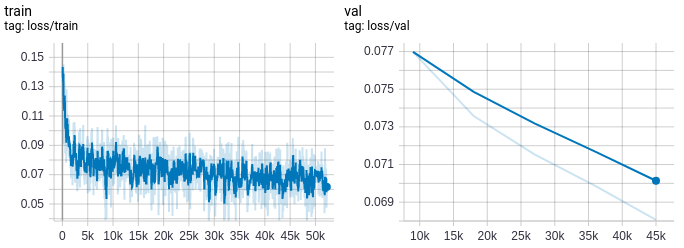
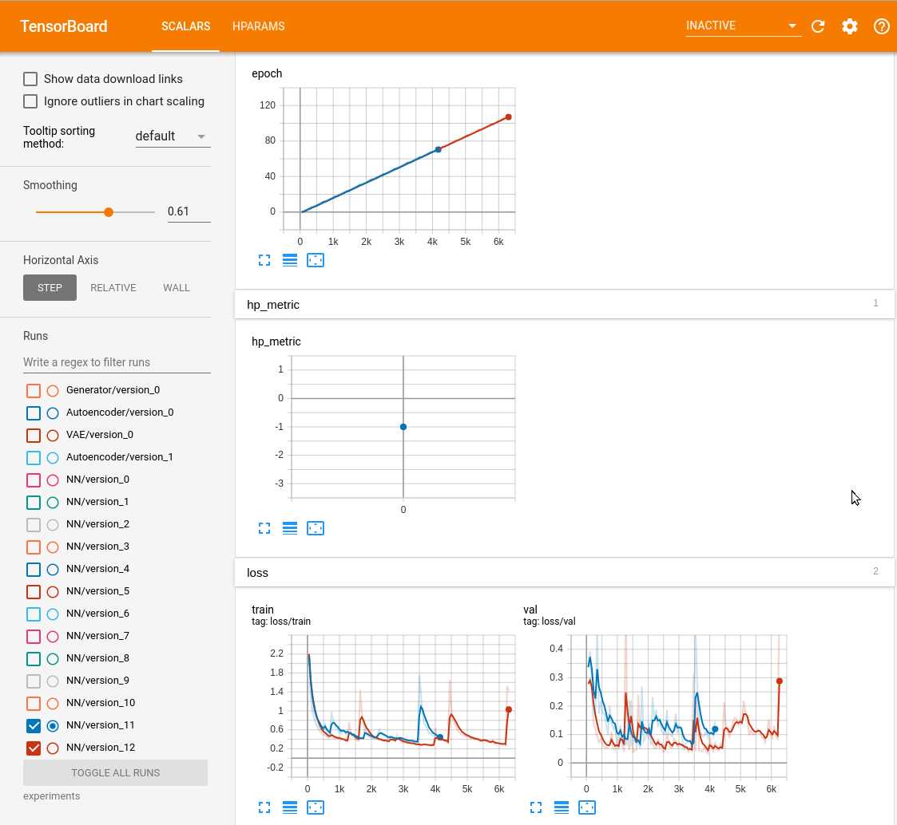
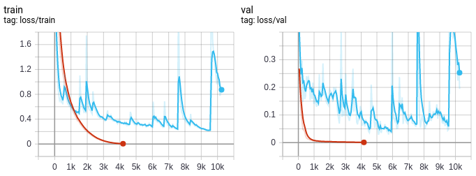
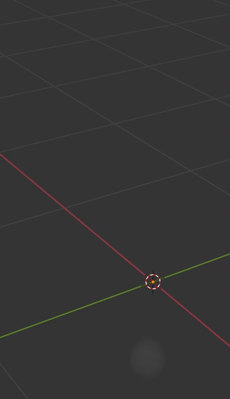
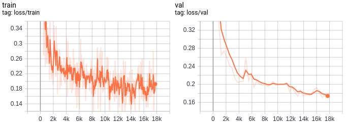
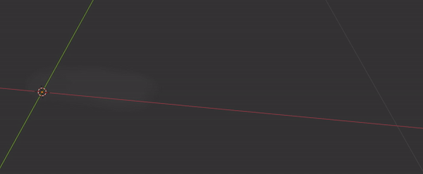

# A pytorch implementation of Deep Fluids paper

## Introduction
This is a pytorch implementation of Deep Fluids paper. The torch sources are located at `src/`. The sources
of the original tensorflow implementation are kept where they were. This is the video playlist 
https://www.youtube.com/watch?v=nryZ-cqfs5E&list=PLX7INEUkOHp8TY3_uuC9EPbDhSbKJNfFt of the results
obtained with the library 

## Install prerequisites
First, create a conda environment for tensorflow, and install the original tensorflow paper requirements by following instructions from `README_tensorflow.md`. Manta package has to be compiled with 
the following call:
```bash
cmake .. -DGUI=OFF -DOPENMP=ON -DNUMPY=ON -DOPENVDB=ON
```
Install pytorch and tensorflow in separate conda environments to avoid dependency problems. Then, create 
 a conda environment for pytorch, and install `pytorch` with GPU support and `pytorch lightning` package.
 
## Install package
Run in Terminal: 
```bash
pip install -e ./
``` 
to install the package.

## Scenes
This project uses 3d smoke scenes from the original repo. There are two scenes we work in this implementation. 

### 3d smoke scene with moving source
In this scene, `scene/smoke3_mov.py`, a smoke source is moving around randomly. In this experiments, we
are going to: 
- train an Autoencoder model
- run inference with the `trained Autoencoder's Encoder model` to obtain `latent code representation`
- train a time integrating Neural Network
- run inference with the `trained Neural Network` on `simulated data from the Neural Network's validation dataset`
- run inference with the `trained Autoencoder's Generator model` on the `data produced by the Neural Network` to obtain `velocity fields`

#### Generate training dataset
To generate a randomly moving source, call in Terminal with the tensorflow conda environment:
```bash
../manta/build/manta scene/smoke3_mov.py
```
this script populates the `data/` directory with 200 simulations of 400 frames each. The velocity fields
are placed into the `data/smoke3_mov200_f400/v/` directory.

#### Train an Autoencoder model
To train a model, run the following script from a pytorch conda environment: 
```bash
python -m deepfluids.train.autoencoder
```
my learning curves:


#### Analyze the learning curves
Observe the training process from tensorboard by calling:
```bash
tensorboard --logdir experiments
```
and opening `localhost/6006` in web browser:



#### Encode velocity fields into the latent code representation
To encode, run:
```bash
python -m deepfluids.test.autoencoder.encode 
```

#### Train a neural network
to train a Neural Network: 
```bash
python -m deepfluids.train.nn
```
my learning curves:


#### Run inference with the neural network
to run inference, call
```bash
python -m deepfluids.test.nn
```

#### Generate the velocity fields 
Now, let's use the data generated by the neural network to produce the velocity fields: 
```bash
python -m deepfluids.test.autoencoder.generate --nn_inference
```

#### Visualize the obtained velocity fields
Then, visualize the generated velocity field located at `experiments/Autoencoder/velocity_field` by calling 
```bash
../manta/build/manta scene/smoke3_vel_advect.py 
```
this command calls `manta` advect method and writes the smoke density in the openVDB format to the 
`data/smoke3_mov200_f400/d_vdb` directory.

#### Import the generated VDB files into Blender->Add Volume
Use blender to visualize the velocity fields. To add Volume in Blender, click `Add->Volume->Import openVDB`.



### 3d smoke scene with varying velocity and buoyancy
In the scene, `scene/smoke3_vel_buo.py`, is used to train a generator. In this experiment, we condense 
the velocity field into a compact latent code representation. The latent code contains 3 elements: 
 velocity, buoyancy and time. At inference, the Generator produces a velocity field using the latent code.

#### Generate training dataset  
We vary the the velocity and buoyancy parameters for training data. To generate the training data, call from
tensorflow conda environment:
```bash
../manta/build/manta scene/smoke3_vel_buo.py
```

#### Tweak the model structure to match you generated scene parameters
You might want to update the neural network structure depending on the parameters you generated the 
data with. See commented out lines in the `model/generator.py` module. This is an hacky at the moment and
needs to be put into the Generator module initialization parameters.

#### Train a model
To train a model, call the following script from a pytorch conda environment:  
```bash
python -m deepfluids.train.generator
```



#### Visualize
To visualize, call the following command in Terminal:
```bash
../manta/build/manta scene/smoke3_vel_buo_advect.py 
```



